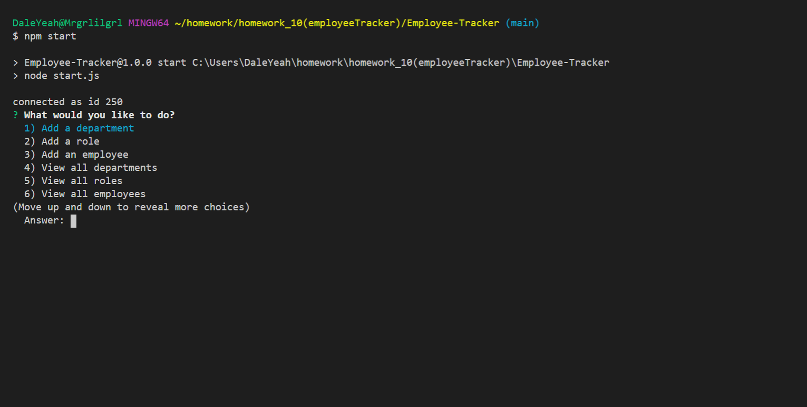

# Employee Tracker

## Description

This is a CMS application that allows for upkeep of an employee database. It gives the control to manage employees by adding new ones, assigning them roles, and managers. The managers and roles can be updated at any time to give flexibility for promotions and new department expansion. I hope you enjoy using the application and keep your employees up to date!

## Table of Contents

-   [Installation Instructions](#installation-instructions)
-   [Usage Information](#usage-information)
-   [License](#license)
-   [Contribution Guidelines](#contribution-guidelines)
-   [Test Instructions](#test-instructions)
-   [Questions](#questions)

## Installation Instructions

This application requires Node.js which can be downloaded <a href="https://nodejs.org/en/" target="_blank">here</a>. It utilizes a few node modules called <a href="https://www.npmjs.com/package/inquirer" target="_blank">inquirer</a>, <a href="https://www.npmjs.com/package/console.table" target="_blank"> console.table</a>, and <a href="https://www.npmjs.com/package/mysql" target="_blank"> mysql</a> and all packages can be installed using <a href="https://www.npmjs.com/" target="_blank">node package manager</a>. This requires a local or remote mySQL server to be running for database storage, there are schema and a seeds file to populate the database. Simply run "npm install" in the root directory then you are ready to rock!

## Usage Information

After running "npm start" or "node start" the user will be given a list of options to manage the database. Once an option is selected they are presented with a series of questions based on the chosen task. The program interfaces with the database behind the scenes to perform the task at hand and then takes the user back to the start with a list of options. The user may select "None" to end the program from the main menu.

Click the image below to view the demo video!

## License

This project is not utilizing a license

## Contribution Guidelines

This is a fully open source project, you may fork the repository and any pull requests will be viewed and implemented accordingly.

## Test Instructions

Install all required modules with "npm install" in the root directory. Then run "npm start" or "node start" to kick the program off. This interacts with a localhost of mySQL server, you may also use a remote instance of mySQL server but you will have to reconfigure the settings accordingly.

## Questions

If there are further questions please contact me with the following.

 AndrewMorrow - <a href="https://github.com/AndrewMorrow" target= "_blank">Github</a>

Email: beardedmongo@gmail.com
